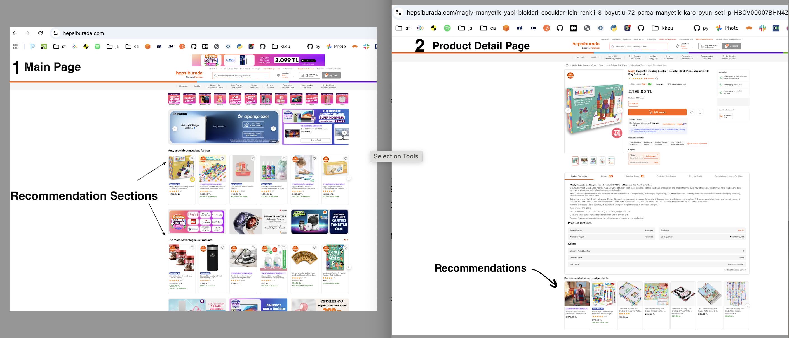

# Task 2. Recommendations section

On the Main page of https://www.hepsiburada.com/ you can see the different Recommendations section with different products. These sections are also shown on Product Detail and Cart pages. What are these product suggestions, what is the rule for listing these products and showing them to the user? Full analysis is expected here. 

## What Are Product Suggestions?

- **Product suggestions** (or recommendations) are dynamically generated lists of products shown to users to encourage further browsing or purchasing. These are typically displayed in dedicated sections such as “You May Also Like,” “Recommended for You,” “Customers Also Bought,” etc.

- **Product recommendations** are a key e-commerce feature, driven by a mix of user data, product data, and business rules. Their placement and logic differ by page to maximize relevance and conversion, using a combination of algorithms and curated rules to select which products to show each user.
---

## Where Are They Shown?

- **Main Page** 
  - Usually features broad recommendations, such as bestsellers, trending products, or personalized picks based on user history.
- **Product Detail Page** 
  - Shows products related to the one being viewed, such as similar items, accessories, or items frequently bought together.
- **Cart Page** 
  - Suggests add-ons, complementary products, or items often purchased with those in the cart (cross-sell/upsell).
---

## Rules for Listing and Showing Products

1. **Main Page Recommendations**
    - **Rule:**
        1. Popularity-based (bestsellers, trending)
        2. Personalized (based on user’s browsing/purchase history)
        3. Seasonal or promotional items
    - **Logic:**
        1. For new/anonymous users: show popular or new arrivals.
        2. For returning users: use browsing/purchase data to personalize.

2. **Product Detail Page Recommendations**
    - **Rule:**
        1. Similarity-based (same category, brand, or attributes)
        2. “Customers Also Viewed” or “Frequently Bought Together”
        3. Complementary products (e.g., accessories)
    - **Logic:**
        1. Use collaborative filtering (what similar users viewed/bought)
        2. Content-based filtering (match product attributes/tags)
        3. Manual curation (merchandiser selects related items)

3. Cart Page Recommendations**
    - **Rule:**
        1. Cross-sell (complementary products)
        2. Upsell (higher-value alternatives)
        3. “Don’t forget” items (consumables, essentials)
    - **Logic:**
        1. Analyze cart contents and suggest related or higher-value products.
        2. Use purchase patterns (what others bought with these items).

## How Are Products Selected?
   - **Algorithms:**
     1. Collaborative filtering (user-user or item-item)
     2. Content-based filtering (product attributes)
     3. Hybrid approaches (combining above)
     4. Rule-based/manual curation
   - **Data Sources:**
     1. User behavior (views, clicks, purchases)
     2. Product metadata (category, tags, price)
     3. Global trends (site-wide popularity)
   - **Personalization Factors**
     1. User’s browsing and purchase history 
     2. Demographics (if available)
     3. Real-time behavior (current session)
     4. Location, device, and time

## Business Goals
1. Increase average order value (AOV)
2. Improve user engagement and retention 
3. Promote new or overstocked products
